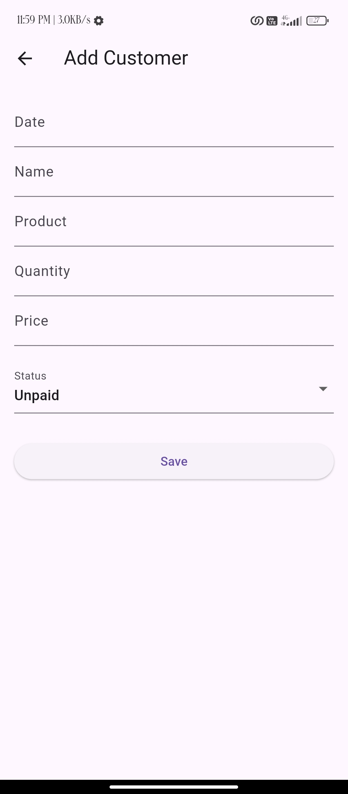
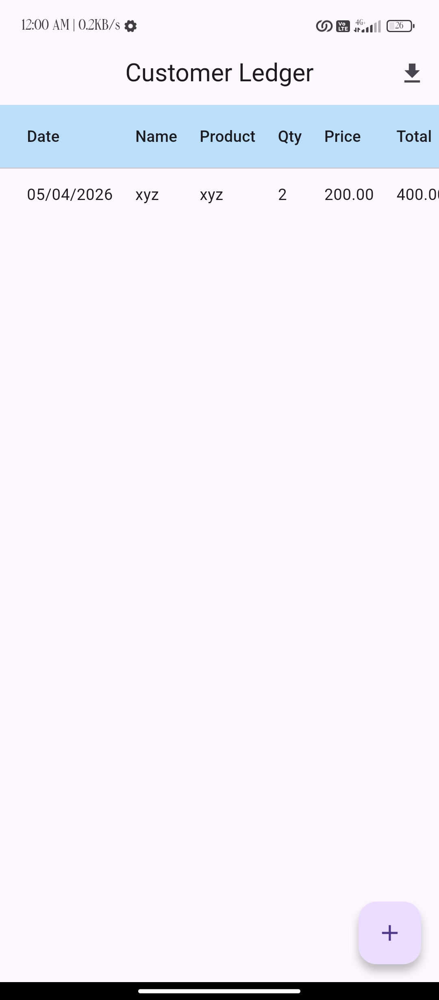
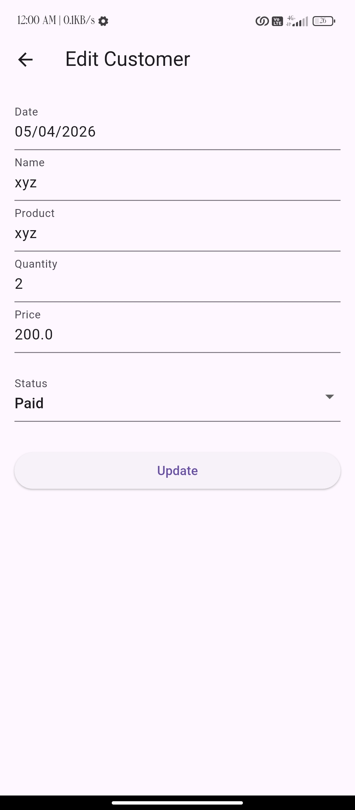
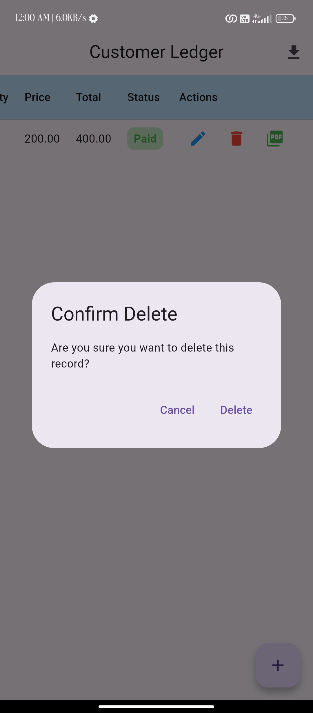
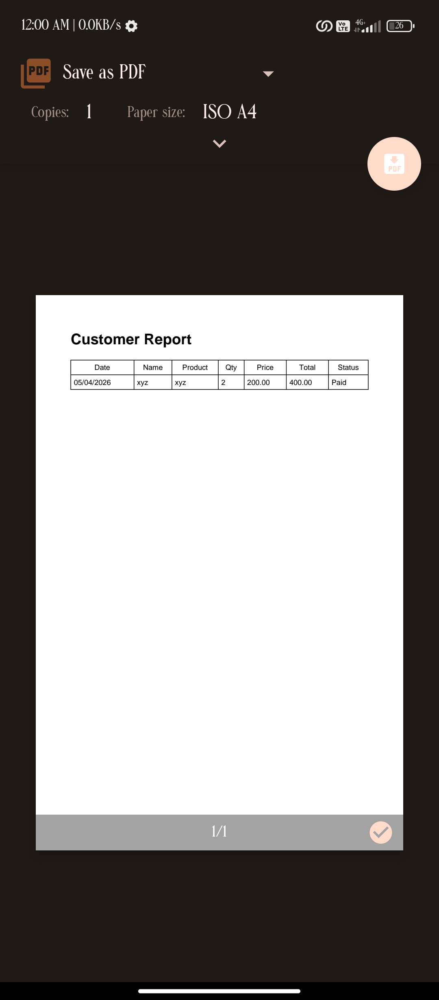

# 📊 Customer Ledger App

A **production-ready Flutter application** for managing customer transactions, inspired by Excel-like data handling with modern mobile UI and advanced features like PDF generation and analytics.

---

## 🚀 Overview

The **Customer Ledger App** allows businesses to efficiently track customer purchases, payments, and outstanding balances. It provides a structured, table-based interface along with powerful export and reporting capabilities.

---

## ✨ Features

### 📋 Core Functionality

* ➕ Add customer records
* ✏️ Edit existing entries
* ❌ Delete records with confirmation
* 📊 View all data in an Excel-like table UI

### 💰 Business Features

* Automatic total price calculation
* Payment status tracking (Paid / Unpaid)
* Dashboard with:

    * Total Revenue
    * Unpaid Amount
    * Total Customers

### 📄 PDF Generation

* Generate **individual customer invoices**
* Export **complete customer report**
* Print / Share PDF directly

### ⚡ User Experience

* Form validation for accurate data entry
* Snackbar feedback for actions
* Loading indicators for smooth UX
* Clean and responsive UI

---

## 🏗️ Architecture

This project follows a **clean architecture approach**:

```
lib/
├── core/            # Constants, utilities, theme
├── data/            # Models, database, repositories
├── domain/          # Business logic, providers
├── presentation/    # UI screens, widgets, PDF
└── routes/          # Navigation
```

### 🔄 Data Flow

```
UI → Provider → Service → Repository → SQLite Database
```

---

## 🛠️ Tech Stack

* **Flutter** – UI development
* **Provider** – State management
* **SQLite (sqflite)** – Local database
* **PDF & Printing** – Document generation

---

## 📸 Screenshots

## 📸 Screenshots

### 🏠 Home Screen


### ➕ Add Customer


### 📊 Dashboard


### Update


### DeleteConfirmation


### 📄 PDF Preview


* Home Screen (Table View)
* Add Customer Form
* Dashboard Analytics
* PDF Invoice Preview

---

## 📦 Installation & Setup

```bash
# Clone the repository
git clone https://github.com/gayatri-kodolkar/datapro.git

# Navigate to project
cd datapro

# Install dependencies
flutter pub get

# Run the app (Android recommended)
flutter run
```

---

## ⚠️ Important Notes

* Data is stored locally using SQLite
* **Uninstalling the app will remove all stored data**
* Web is not supported due to SQLite limitations

---

## 🚀 Future Improvements

* 🔐 User Authentication (Login system)
* ☁️ Cloud Sync (Firebase / Backend API)
* 📊 Advanced analytics & charts
* 📁 Export to Excel
* 🎨 UI enhancements & animations

---

## 💼 Resume Highlight

> Developed a full-featured Customer Ledger mobile application using Flutter, implementing clean architecture, SQLite-based local storage, PDF invoice generation, and real-time analytics dashboard.

---

## 👨‍💻 Author

**Gayatri-Kodolkar**

* Passionate Flutter Developer
* Focused on building scalable and user-friendly applications

---

## ⭐ Contribution

If you like this project:

* ⭐ Star the repository
* 🍴 Fork it
* 🛠️ Improve and contribute

---

## 📜 License

This project is open-source and available under the MIT License.

---
